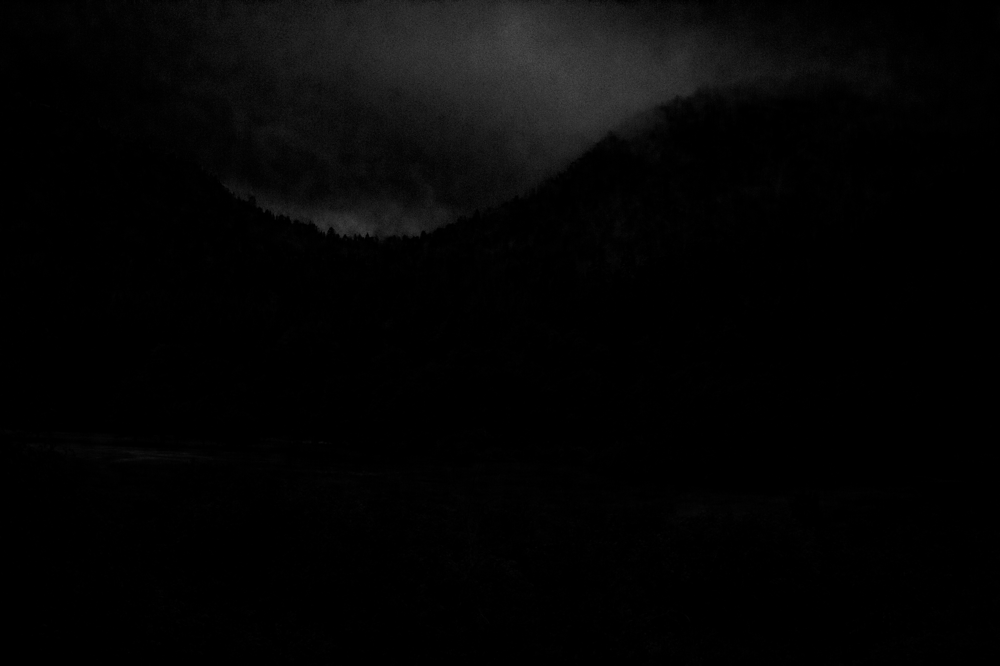

# Work carried out during the session

We started implementation of the dehazing pipeline by computing a dark channel function and the atmospheric light function.

```python
#dark channel computation
import numpy as np
import cv2, math

image = cv2.imread('P1011083.JPG')
b, g, r = cv2.split(image)

r = r.astype('uint8')
g = g.astype('uint8')
b = b.astype('uint8')

n, m = b.shape
print(n,m)
dark_channel = np.ndarray([n,m])

#fenêtres 3x3
dim = 3
d = math.floor(dim / 2) 

for i in range (n):
    for j in range(m):
        minb = min(b[max(0, i - d): min(n-1, i + d), max(0, j - d): min(m-1, j + d)].flatten())
        ming = min(g[max(0, i - d): min(n-1, i + d), max(0, j - d): min(m-1, j + d)].flatten())
        minr = min(r[max(0, i - d): min(n-1, i + d), max(0, j - d): min(m-1, j + d)].flatten())
        dark_channel[i, j] = min(minr, ming, minb)

dark_channel = dark_channel.astype('uint8')
dark_channel = np.flip(dark_channel)   # flip vertically

cv2.imshow("dark channel",dark_channel)
cv2.imwrite("dark_channel.png", dark_channel)
cv2.waitKey(0)
cv2.destroyAllWindows()
```
```python
import numpy as np
import cv2 as cv

def estimate_atmospheric_light(image, dark_channel, n, m):
    mat_size = (n * m) // 1000
    gs_image = cv.cvtColor(image, cv.COLOR_BGR2GRAY)

    top_dark_idx = np.argsort(dark_channel.flatten())[-mat_size:]
    top_dark_idx= np.unravel_index(top_dark_idx, dark_channel.shape)

    max_intensity = -np.inf
    max_idx = (0, 0)

    for x, y in zip(*top_dark_idx):
        local_intensity = gs_image[x, y]
        if max_intensity < local_intensity:
            max_intensity = local_intensity
            max_idx = (x, y)
        
    return image[max_idx]
```

Example of an estimated dark channel yielded by our code:



## Difficulties encountered
The example image is very big and the dark channel function has very high complexity, which makes for a very long execution time. To remedy we tried using a smaller image but ultimately we have to experience with the final image to make sure the format is right.

Also not sure why, but the dark channel grayscale image output is inverted, so we have to flip it both vertically and horizontally before displaying and saving it.

A typo in the "estimation of atmospheric light" section led us to a confusing understanding of its computation. However it was quickly resolved through rereading prior sections of the paper.

# Future sessions

Continue pipeline implementations and start executing with openMP to save time in development.